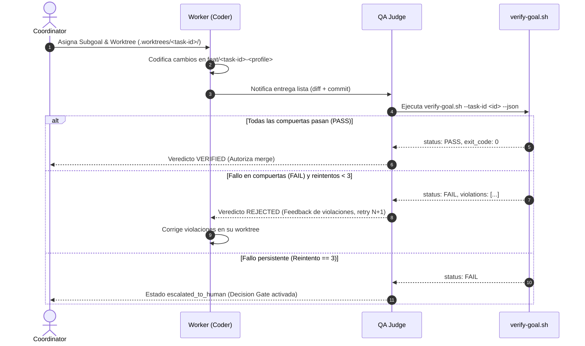

# Goal Evaluation & Ralph Loop (Independent Judge Protocol)

Esta skill formaliza el papel del **Judge Independiente** (o agente `qa-judge`) dentro de la arquitectura multi-agente de agent-os. Implementa el patrón **Ralph Loop** de NousResearch / Hermes Agent para desacoplar al obrero de código (Worker / Coder) de la compuerta de validación técnica, evitando sesgos de auto-evaluación y alucinaciones.

## Cuándo usar
- Actuar como Judge independiente (rol `qa-judge`) para auditar la entrega de un worker o subagente antes del merge.
- Ejecutar ciclos de validación Ralph Loop sobre contratos de meta (`.agents/goals/*.yaml`).
- Evaluar deterministamente mediante `verify-goal.sh` y diffs si los cambios respetan la caja de archivos y tests sin sesgo de auto-evaluación.

---

## Principios del Judge Independiente

1. **Desacoplamiento Estricto de Roles**:
   - El Worker (`coder`) implementa la solución y realiza commits dentro de su worktree aislado.
   - El Judge (`qa-judge`) **NUNCA escribe código nuevo** ni soluciona bugs directamente. Su única responsabilidad es auditar la entrega contra los contratos declarativos.
2. **Evaluación Determinista a 0 Tokens**:
   - La primera barrera evaluadora es siempre `scripts/agent/verify-goal.sh --json`.
   - Si las compuertas duras (working tree, allowlist de archivos, test suite) fallan, el veredicto es inmediatamente `FAIL`.
3. **Feedback Estructurado y Accionable**:
   - En caso de `FAIL`, el Judge no emite comentarios genéricos; desglosa con exactitud las violaciones detectadas (rutas no autorizadas en el diff, tests rotos o cambios pendientes).
4. **Circuito de Parada (Circuit Breaker)**:
   - Se permite un **máximo de 3 iteraciones de corrección (retries)** por parte del Worker.
   - Si al **tercer intento consecutivo** `verify-goal.sh` continúa devolviendo `FAIL`, la tarea se congela y pasa automáticamente a estado:
     `escalated_to_human`
   - Se activa un **Decision Gate** (`pending_approval`), notificando al usuario en la terminal principal para desbloqueo manual.

---

## Flujo Operativo del Ralph Loop



---

## Protocolo Paso a Paso para el Agente Judge

### 1. Invocación de la Compuerta Técnica Determinista
El Judge ejecuta dentro del repositorio o worktree de la tarea:

```bash
bash scripts/agent/verify-goal.sh --task-id <TASK_ID> --json
```

Si el script devuelve código distinto de 0:
- Extrae la lista de `violations` y el estado de `tests_pass`.
- Verifica el contador de reintentos en el task file o goal manifest (`retry_count`).

### 2. Inspección del Diff y del End State Contract
Si `verify-goal.sh` pasa (`PASS`), el Judge realiza una lectura compacta del diff para contrastar contra los criterios binarios del `goal.schema.md`:

```bash
git diff --stat HEAD~1..HEAD
```

Preguntas clave de auditoría:
- ¿Se respetó el principio SRP (Single Responsibility Principle)?
- ¿Se introdujeron dependencias no aprobadas o credenciales?
- ¿El código sigue las reglas agnósticas de agent-os?

### 3. Emisión del Veredicto Estructurado

El Judge debe registrar y comunicar el veredicto usando este formato Markdown estandarizado:

```markdown
### 🛡️ VEREDICTO DEL JUDGE (Ralph Loop) — [<TASK_ID>]

- **Estado**: [VERIFIED | REJECTED | ESCALATED_TO_HUMAN]
- **Intento**: [1/3 | 2/3 | 3/3]
- **Allowlist Pass**: [true | false]
- **Tests Pass**: [true | false]
- **Working Tree Clean**: [true | false]

#### 📋 Diagnóstico Detallado:
- [Explicación concisa del resultado de verify-goal.sh]
- [Violaciones de archivos detectadas, si las hubiera]
- [Tests fallidos con stack trace resumido, si aplica]

#### 🎯 Acción Requerida:
- Si VERIFIED: Proceder a `worktree-merge.sh` y desmantelamiento.
- Si REJECTED: Worker debe corregir exclusivamente los puntos anteriores y reenviar.
- Si ESCALATED_TO_HUMAN: Sesión detenida. Esperando comando de usuario.
```

---

## Manejo de Excepciones y Reglas Críticas

- **Prohibición de Edición**: Si el Judge edita archivos en el worktree del Worker, se produce una violación grave de concurrencia. Debe limitarse a lectura y ejecución de diagnósticos.
- **Circuit Breaker Obligatorio**: Nunca superar los 3 reintentos automáticos. Bucle infinito = agotamiento de recursos y saturación de contexto.
- **Contrato Binario**: Si un solo archivo no está en el allowlist, no hay margen de discrecionalidad: el veredicto es `FAIL`.
