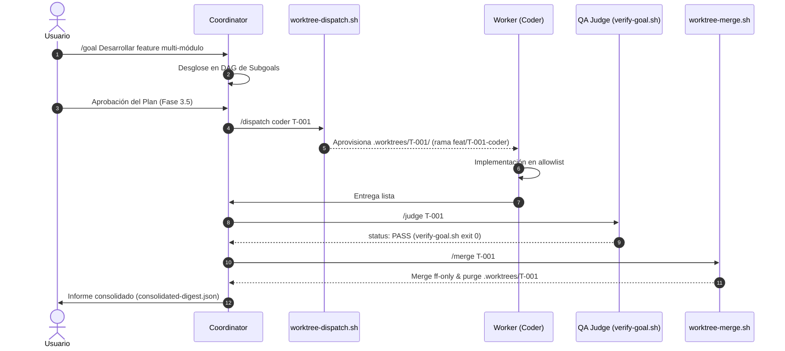

# Orchestrator — Skill de Orquestación Declarativa Multi-Agente

Esta skill proporciona la interfaz de comandos operativos y el motor declarativo para que el agente **Coordinator** descomponga, despache, evalúe y consolide lotes de trabajo ejecutados por agentes concurrentes en Git Worktrees efímeros, garantizando coste 0 de tokens en las compuertas duras y preservación estricta de disco (ADR 004).

---

## 1. Gramática de Comandos Declarativos y Mapeo Determinista

La skill unifica la sintaxis de comandos agnósticos, traduciéndolos de forma unívoca a flags de los scripts CLI del core:

| Comando Declarativo | Función / Rol | Mapeo Determinista CLI (Bash a 0 tokens) |
|---|---|---|
| `/goal <título>` | Registra la meta de alto nivel con End State Contract | Instancia `templates/goals/goal.schema.md` en `.agents/goals/goal-<ID>.md` |
| `/subgoal <título> [perfil]` | Añade un nodo al DAG de tareas asignado a un perfil | Registra tarea en `.agents/tasks/task-<ID>.md` con allowlist y dependencias |
| `/dispatch <perfil> <task-id>` | Aprovisiona el worktree efímero e inyecta contexto | `bash scripts/agent/worktree-dispatch.sh --task-id <task-id> --profile <perfil> --json` |
| `/judge <task-id>` | Invoca la compuerta de validación independiente (Ralph Loop) | `bash scripts/agent/verify-goal.sh --task-id <task-id> --strict --json` |
| `/gate approve\|reject <task-id>` | Compuerta de decisión humana (Human-in-the-loop) | Registra veredicto en `.agents/tasks/task-<task-id>.md` y desbloquea el DAG |
| `/merge <task-id> [target]` | Valida, integra hacia la rama destino y purga inodos | `bash scripts/agent/worktree-merge.sh --task-id <task-id> --target <target> --json` |
| `/promote [source] [--target main] [--push]` | Promueve de forma determinista la rama a main y sincroniza con remoto | `bash scripts/agent/promote-to-main.sh --source <source> --target <target> [--push] --json` |

---

## 2. Compatibilidad Multiplataforma

La gramática de `/orchestrator` es agnóstica del runtime subyacente y se adapta a:

1. **Hermes Agent (NousResearch / chat front-door)**:
   - Mapeo nativo a slash-commands (`/goal`, `/subgoal`).
   - Envío de notificaciones a través de la pasarela de mensajería (WhatsApp/Telegram/Slack) solicitando `/gate approve`.
2. **Orca ADE (onorca.com / Desktop IDE)**:
   - Integración directa con los runners de tareas en worktrees efímeros (`.worktrees/<task-id>/`).
   - Sincronización con el bus de eventos de federación (`control-mail` y compuertas `pending_approval`).
3. **Terminales CLI y ACP (Anthropic / Claude Code / OpenCode)**:
   - Ejecución sin interfaz gráfica vía scripts Bash estándar consumiendo salidas JSON estructuradas.

---

## 3. Flujo Operativo del Coordinador (Single-Pane of Glass)

El Coordinador opera mediante 4 momentos estandarizados:



---

## 4. Consolidación Desatendida (`consolidated-digest.json`)

Para evitar que el usuario supervise manualmente cada worktree, el orquestador mantiene el estado global del lote en `.agents/context/dag-state.json` y genera un digest compacto al finalizar todas las submetas:

```json
{
  "goal_id": "GOAL-2026-09-27-01",
  "status": "COMPLETED",
  "total_subgoals": 3,
  "completed": 3,
  "failed": 0,
  "escalated": 0,
  "worktrees_purged": true,
  "tasks": [
    {
      "task_id": "T-054",
      "profile": "coder",
      "branch": "feat/T-054-deterministic-goals-engine",
      "judge_verdict": "PASS",
      "merged_into": "multi-agent"
    }
  ]
}
```

---

## 5. Reglas Críticas de Seguridad y Concurrencia

1. **Aislamiento Estricto**: Ningún worker puede acceder o modificar archivos de otro worktree concurrentemente.
2. **Circuit Breaker Activo**: Si `/judge` reporta `FAIL` en 3 intentos sucesivos, el Coordinator **detiene el lote** y solicita intervención mediante `/gate`.
3. **Purga Inmediata (ADR 004)**: Todo comando `/merge` completado debe forzar la eliminación del worktree y el `git worktree prune` para no saturar almacenamiento.

---

## 6. Protocolo de Promoción a Main y Decision Gate (`/promote`)

El comando `/promote` consolida la rama de trabajo hacia `main` (o la rama principal configurada) de forma totalmente determinista mediante `scripts/agent/promote-to-main.sh`.

### 6.1 Salvaguardas Deterministas
1. **Working Tree Limpio**: Comprueba de forma preventiva que no existan modificaciones o archivos huérfanos sin confirmar.
2. **Resolución de Topología de Worktrees**: Si la rama `main` está en uso por otro worktree (ej. `/home/romen/Proyectos/agent-os`), el script detecta automáticamente su ubicación mediante `git worktree list --porcelain`, valida su limpieza y ejecuta la consolidación `git -C <target_wt> merge --ff-only <source>` allí directamente, evitando colisiones de working tree.
3. **Ejecución Mandatoria de Pruebas**: Ejecuta la suite completa `tests/validate-control-plane.sh` antes de realizar cualquier cambio en las ramas.

### 6.2 Decision Gate Mandatorio (Human-in-the-loop)
El agente **nunca debe ejecutar `/promote` de manera silenciosa ni desatendida**. Antes de invocar el comando o script, está obligado a presentar un Decision Gate al usuario con la siguiente estructura:

```markdown
### 🛑 Decision Gate: Autorización de Promoción a Main (/promote)

- **Rama Origen (Source)**: `multi-agent`
- **Rama Destino (Target)**: `main`
- **Commit SHA**: `6d058dc` — «docs(sprint): mark sprint-09-core as completed»
- **Estado de Pruebas**: ✅ Control Plane 100% verificado (10/10 checks)
- **Acción Remota (--push)**: true (sincronizar con GitHub origin/main)

Por favor, confirma con **APROBADO** para proceder a consolidar en main y sincronizar con el repositorio remoto.
```

Únicamente tras recibir la confirmación explícita del usuario, el orquestador invocará `bash scripts/agent/promote-to-main.sh`.
