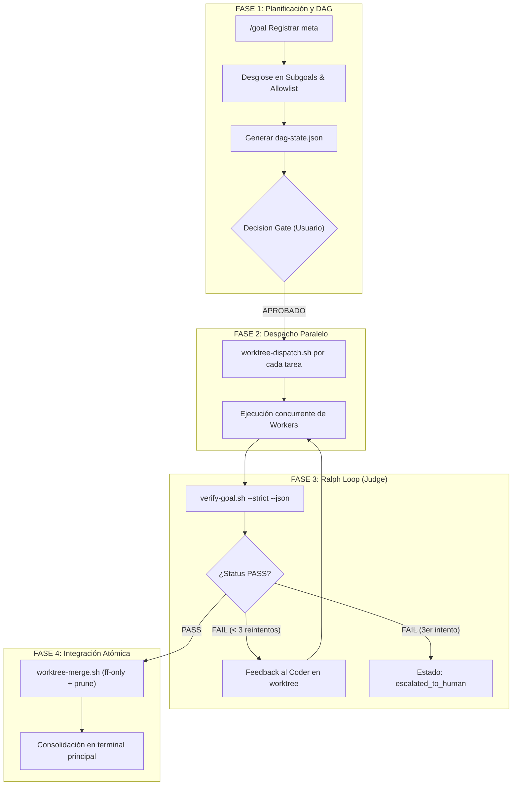

# parallel-orchestration

> Duración estimada por lote: 15–45 min. Ejecutar bajo el rol **Coordinator** en la terminal principal de {{PROJECT_NAME}}.

## Objetivo

- Coordinar la ejecución paralela y desatendida de múltiples tareas técnicas mediante agentes especialistas (`coder`, `qa-judge`, `docs-researcher`).
- Garantizar el aislamiento estricto de cada agente en su propio Git Worktree efímero (`.worktrees/<task-id>/`), evitando colisiones en disco o ramas sucias.
- Aplicar compuertas de calidad deterministas a 0 tokens (`verify-goal.sh`) y el bucle de validación independiente **Ralph Loop**.
- Preservar la higiene del repositorio y del sistema de archivos purgando atómicamente los worktrees tras su integración (ADR 004).

---

## Perímetro y Restricciones de Cómputo (ADR 004)

> ⚠️ **RESTRICCIÓN CRÍTICA DE ALMACENAMIENTO Y HOSTS**:
>
> 1. **Hosts Autorizados para Paralelismo**: La creación de Git Worktrees concurrentes está permitida **únicamente** en el entorno local de desarrollo (`inteligencia-colectiva`) o en nodos worker de cómputo dedicados con espacio en disco suficiente (>20 GB disponibles).
> 2. **Prohibición Estricta en Nodo `oracle`**: Queda **terminantemente prohibido** aprovisionar lotes de worktrees en el servidor de producción `oracle` (`vnic-rsr`). Dicho nodo presenta un 72% de uso en su volumen raíz y aloja bases de datos operativas críticas. Toda tarea sobre `oracle` se ejecuta en modo secuencial y directo según el runbook de mantenimiento.

---

## Archivos y Rutas a Revisar

- `templates/goals/goal.schema.md`
- `.agents/tasks/`
- `.agents/context/dag-state.json`
- `.worktrees/`
- `scripts/agent/worktree-dispatch.sh`
- `scripts/agent/verify-goal.sh`
- `scripts/agent/worktree-merge.sh`

---

## Protocolo Operativo en 4 Fases



---

### FASE 1 — Desglose y Construcción del DAG

1. **Recepción de la Meta**:
   El Coordinator recibe la intención y define el End State Contract completando `templates/goals/goal.schema.md`.
2. **Definición de Submetas y Allowlist**:
   Para cada subtarea, genera su task file correspondiente en `.agents/tasks/task-<ID>.md` especificando con rigor la **Caja de Archivos Autorizados**.
3. **Registro Persistente del DAG (`.agents/context/dag-state.json`)**:
   Para evitar condiciones de carrera y permitir pausas o reinicios de sesión sin perder la traza de los worktrees activos, el Coordinator inicializa el archivo de seguimiento:
   ```json
   {
     "goal_id": "GOAL-T-057",
     "target_branch": "multi-agent",
     "active_worktrees": {
       "T-057-01": {
         "profile": "coder",
         "branch": "feat/T-057-01-coder",
         "path": ".worktrees/T-057-01",
         "status": "pending_dispatch",
         "retry_count": 0
       }
     }
   }
   ```
4. **Decision Gate Obligatorio (Fase 3.5)**:
   Presenta el plan consolidado en la terminal principal y espera el comando explícito `APROBADO` antes de tocar el sistema de archivos.

---

### FASE 2 — Despacho Concurrente en Worktrees Aislados

Por cada nodo independiente en el DAG:

1. **Aprovisionamiento**:
   ```bash
   bash scripts/agent/worktree-dispatch.sh --task-id <TASK_ID> --profile <PROFILE> --base <TARGET_BRANCH> --json
   ```
2. **Inyección de Entorno**:
   El script genera `.worktrees/<TASK_ID>/.agents/context/worktree.env` exportando `AGENT_OS_ROOT` y las referencias de la tarea.
3. **Puesta en Marcha**:
   El worker asignado inicia su trabajo dentro del directorio `.worktrees/<TASK_ID>/`, aislado de cualquier otro agente concurrente.
4. **Actualización del DAG**:
   El Coordinator marca la tarea como `in_progress` en `dag-state.json`.

---

### FASE 3 — Evaluación Independiente (Ralph Loop / Circuit Breaker)

Cuando un worker notifica la finalización de sus cambios:

1. **Invocación del Judge**:
   El Coordinator ejecuta la compuerta técnica determinista:
   ```bash
   (cd .worktrees/<TASK_ID> && bash "$AGENT_OS_ROOT/scripts/agent/verify-goal.sh" --task-id <TASK_ID> --base <TARGET_BRANCH> --strict --json)
   ```
2. **Análisis de Veredicto**:
   - Si `status: PASS`: El Judge autoriza la integración hacia la Fase 4.
   - Si `status: FAIL`:
     - Se incrementa el contador `retry_count` en `dag-state.json`.
     - **Si `retry_count < 3`**: El Judge envía las violaciones estructuradas al worker para su auto-corrección inmediata en el worktree.
     - **Si `retry_count == 3` (Circuit Breaker)**: Se suspende el trabajo automático en esa subtarea, se marca `status: escalated_to_human` y se emite una alerta bloqueante en la terminal principal.

---

### FASE 4 — Integración Segura, Merge Atómico y Purga ADR 004

Una vez obtenido el veredicto `PASS`:

1. **Ejecución del Merge y Limpieza de Inodes**:
   El Coordinator ejecuta desde el repositorio principal:
   ```bash
   bash scripts/agent/worktree-merge.sh --task-id <TASK_ID> --target <TARGET_BRANCH> --json
   ```
   El script:
   - Valida nuevamente las compuertas técnicas.
   - Realiza el merge seguro (`--ff-only`).
   - Ejecuta `git worktree remove --force .worktrees/<TASK_ID>`.
   - Ejecuta `git worktree prune` para purgar metadatos de `.git/worktrees/`.
   - Elimina la rama efímera `feat/<TASK_ID>-<PROFILE>`.
2. **Actualización de Estado**:
   Marca la submeta como `completed` en `dag-state.json`.
3. **Cierre del Lote y Reporte Consolidado**:
   Cuando todas las tareas del DAG concluyen, el Coordinator emite el `consolidated-digest.json` y presenta el resumen final en la terminal principal (Single-Pane of Glass).
