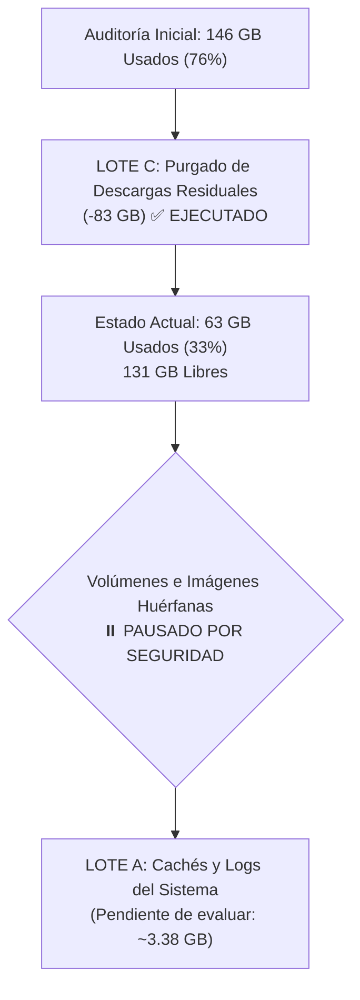

# Plan de Recuperación de Espacio en Disco por Lotes en Servidores VPS

> **Fecha de Auditoría Inicial**: 2026-09-27  
> **Host**: `<infra-node>` (IP Tailscale `<TAILSCALE_IP>`, configurado en `config/fleet.yaml` o `~/.ssh/config`)  
> **Sistema Operativo**: Linux / Ubuntu LTS  
> **Motor de Contenedores**: Docker Engine  
> **Objetivo**: Registro de auditoría, ejecución del saneamiento y delimitación estricta de exclusiones de seguridad para volúmenes e imágenes en el VPS de infraestructura.

---

## 1. Cifras Actualizadas de Almacenamiento (Post-Ejecución)

### 1.1 Estado de la Partición Raíz (`df -hT` y `df -ih`)

```text
Filesystem     Type      Size  Used Avail Use% Mounted on
/dev/sda1      ext4      193G   63G  131G  33% /
/dev/sda16     ext4      891M  147M  682M  18% /boot
/dev/sda15     vfat       98M  6.4M   92M   7% /boot/efi
```

```text
Filesystem     Inodes   IUsed   IFree IUse% Mounted on
/dev/sda1         25M    1.5M     24M    6% /
```

- **Uso de Bloques**: Ha pasado de **146 GB (76%)** a **63 GB (33%)**, liberando **83 GB netos** tras la purga del lote de medios.
- **Espacio Libre Disponible**: **131 GB disponibles** (frente a 48 GB previos).
- **Uso de Inodos**: Totalmente desahogado (6% en uso, 24M libres).

---

### 1.2 Desglose Macroscópico del Host Tras Ejecución

| Ruta Principal | Tamaño Ocupado | Componentes Principales |
| :--- | :--- | :--- |
| **`/var/lib/docker`** | **36.0 GB** | Capas de imágenes / rootfs, volúmenes activos/huérfanos, contenedores, buildkit. |
| **`~/`** | **~4.0 GB** | `.cache`, memoria operativa de agentes, scripts y backups SQL. |
| **`/var/log`** | **2.8 GB** | Journald, logs de Docker, logs de auditoría/syslog. |
| **`/usr`, `/snap`, `/opt`** | **~5.1 GB** | Binarios del sistema, paquetes snap e instaladores base. |

---

### 1.3 Estado de la Capa de Contenedores (`docker system df -v`)

```text
TYPE            TOTAL     ACTIVE    SIZE      RECLAIMABLE
Images          40        36        41.1GB    38.27GB (93%)*
Containers      38        38        659.2MB   0B (0%)
Local Volumes   47        18        3.508GB   480.5MB (13%)
Build Cache     9         9         2.183GB   0B
```

---

### 1.4 Estado de la Infraestructura Crítica

- **Total contenedores en ejecución**: Verificados contenedores activos UP (0 caídos, 0 reiniciando).
- **Core de Infraestructura**:
  - Reverse Proxy (Traefik/Nginx): `Up (healthy)`
  - Bases de Datos (Postgres/Redis): `Up (healthy)`
  - Servicios de gestión y colas: `Up (healthy)`

---

## 2. Decisiones de Seguridad y Exclusiones Explícitas

### 2.1 Volúmenes Expresamente Excluidos (Salvaguarda Absoluta)

Quedan formalmente blindados y fuera de cualquier acción de poda:
- `bytebox-data` (Montaje de snippets y persistencia de ByteBox)
- `homepage-config` (Configuraciones dinámicas de Homepage)

### 2.2 Política de Bloqueo sobre Volúmenes e Imágenes Huérfanas

Se ha determinado pausar y **no autorizar** la eliminación de volúmenes huérfanos ni de imágenes huérfanas sin inspección profunda previa, fundamentado en tres razones directivas:

1. **Estado durmiente de apps**: Un volumen puede figurar sin enlaces directos (`links=0`) en Docker y aun así corresponder al estado íntegro de una aplicación que se decida reactivar.
2. **Naturaleza persistente crítica**: Volúmenes de bases de datos albergan datos relacionales y de almacenamiento de objetos que, incluso proviniendo de servicios retirados, pueden contener información histórica o configuraciones valiosas.
3. **Ratio de riesgo / beneficio desproporcionado**: El ahorro estimado total en volúmenes huérfanos es marginal (<1 GB). Tras haber recuperado 83 GB y situar el disco al 33% de ocupación, no existe urgencia operativa que justifique asumir ningún riesgo de pérdida de datos.

---

## 3. Estado de Ejecución de Lotes



---

### LOTE C: Purgado de Archivos de Medios Huérfanos [✅ COMPLETADO]

- **Estado**: **Completado con éxito**.
- **Acción realizada**: Eliminación de vídeos y fotos residuales en `~/downloads` tras confirmación de respaldo completo en el equipo local del usuario.
- **Comando ejecutado**:
  ```bash
  ssh <infra-node> "sudo -n find ~/downloads -mindepth 1 -delete"
  ```
- **Resultado comprobado**:
  - Directorio `~/downloads` preservado con permisos intactos.
  - Espacio liberado: **83.0 GB**.
  - Los contenedores continúan en ejecución (`Up`).

---

### LOTE B: Volúmenes Huérfanos Obsoletos [🛑 BLOQUEADO / NO AUTORIZADO]

- **Estado**: **Pausado indefinidamente**.
- **Criterio**: Exclusión total. No se tocará ningún volumen hasta realizar auditorías específicas de contenido cuando se requiera.

---

### LOTE A: Higiene y Cachés de Sistema [🟡 PENDIENTE DE REVISIÓN]

- **Estado**: Pendiente de decisión si se requiere mayor margen futuro.
- **Acciones viables de riesgo nulo (sin tocar imágenes)**:
  1. Compactar logs de journald a 500 MB (`sudo journalctl --vacuum-size=500M`): recupera **~1.90 GB**.
  2. Limpiar caché de entorno de usuario (`rm -rf ~/.cache/uv ~/.cache/ms-playwright`): recupera **~1.48 GB**.
  3. Docker build cache (`docker builder prune -f`): recupera **~2.18 GB**.

---

## 4. Tabla Histórica y Comparativa de Almacenamiento

| Hito | Espacio Usado | Espacio Libre | Ocupación (`/dev/sda1`) | Estado Operativo |
| :--- | :---: | :---: | :---: | :--- |
| **Auditoría Previa** | 139 GB | 55 GB | 72% | Alerta por consumo elevado. |
| **Inicio de Despliegues** | 146 GB | 48 GB | 76% | Nuevos contenedores (+7 GB). |
| **Post-Lote C** | **63 GB** | **131 GB** | **33%** | **✅ 83 GB liberados. Contenedores 100% operativos.** |
