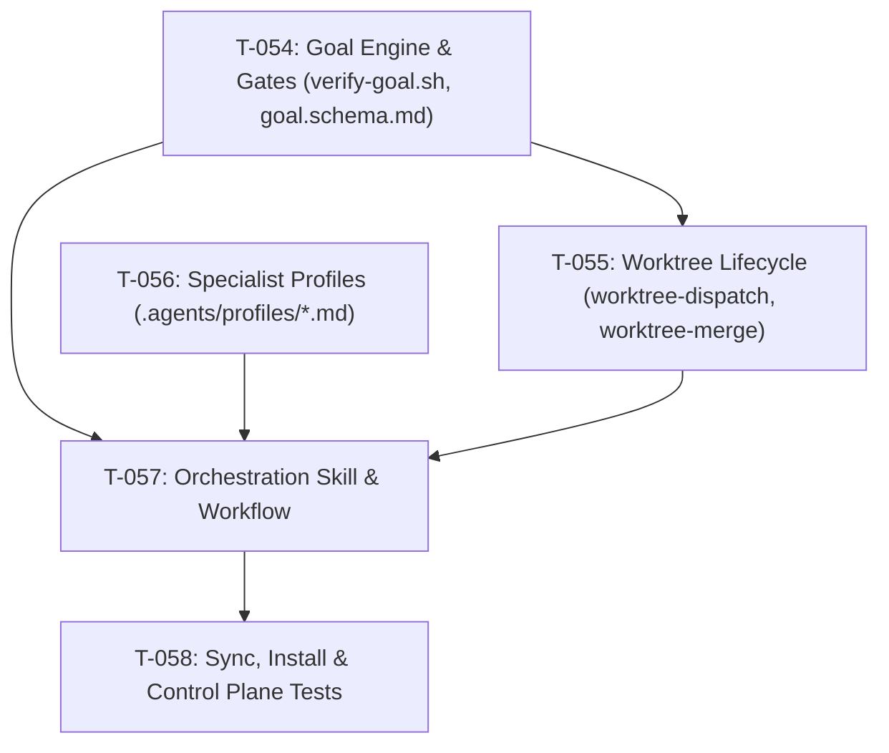

# Sprint 09 — Core

**Período**: 2026-09-27 → 2026-10-04  
**Objetivo**: «Multi-Agent Parallel Orchestration & Deterministic Goals Engine». Dotar a agent-os de capacidades avanzadas de orquestación inspiradas en Hermes Agent (Persistent Goals y bucle Ralph Loop de validación/Quality Gates a 0 tokens de inferencia) y Orca ADE (aislamiento estricto de workers concurrentes mediante Git Worktrees efímeros sin colisiones en disco). Implementar contratos declarativos de metas, motor de verificación determinista en Bash/POSIX, gestión del ciclo de vida de worktrees, perfiles especialistas (`coordinator`, `coder`, `qa-judge`, `docs-researcher`), skill y workflow de orquestación, integración en `sync.sh`/`install.sh` y validación integral en `tests/validate-control-plane.sh`.

---

## Estado
🟡 En curso

---

## Tareas del Sprint (Fase 2C / Core)

| ID | Descripción | Categoría | Tamaño | Estado | Dependencias / Bloqueos | Task file |
| :--- | :--- | :---: | :---: | :---: | :--- | :---: |
| T-054 | Contratos de Metas Persistentes (`goal.schema.md`), Motor Determinista (`verify-goal.sh`) y Skill de Evaluación Judge (`goal-evaluation`) | Nueva herramienta | M | ✅ Completada | — | [.agents/tasks/_archived/task-054.md](file:///home/romen/orca/workspaces/agent-os/multi-agent/.agents/tasks/_archived/task-054.md) |
| T-055 | Motor de Aislamiento y Ciclo de Vida de Git Worktrees (`worktree-dispatch.sh`, `worktree-merge.sh`) | Nueva herramienta | M | ✅ Completada | T-054 (`verify-goal.sh`) | [.agents/tasks/_archived/task-055.md](file:///home/romen/orca/workspaces/agent-os/multi-agent/.agents/tasks/_archived/task-055.md) |
| T-056 | Perfiles Especialistas Declarativos (`coordinator.md`, `coder.md`, `qa-judge.md`, `docs-researcher.md`) | Universalización | S | ✅ Completada | — | [.agents/tasks/_archived/task-056.md](file:///home/romen/orca/workspaces/agent-os/multi-agent/.agents/tasks/_archived/task-056.md) |
| T-057 | Skill y Workflow de Orquestación Paralela Multi-Agente (`orchestrator/SKILL.md`, `parallel-orchestration.md`) | DX / Documentación | M | ✅ Completada | T-054, T-055, T-056 | [.agents/tasks/_archived/task-057.md](file:///home/romen/orca/workspaces/agent-os/multi-agent/.agents/tasks/_archived/task-057.md) |
| T-058 | Distribución Core (`sync.sh`, `install.sh`) y Hardening de Suite de Pruebas (`validate-control-plane.sh`) | Universalización | S | ✅ Completada | T-054, T-055, T-056, T-057 | [.agents/tasks/_archived/task-058.md](file:///home/romen/orca/workspaces/agent-os/multi-agent/.agents/tasks/_archived/task-058.md) |

---

## Lotes Sugeridos de Ejecución (DAG)

- **Lote 1 (Cimientos del Contrato y Aislamiento)**:
  - `T-054` (Esquema de metas + `verify-goal.sh` determinista a 0 tokens + Skill `goal-evaluation` para QA Judge).
  - `T-056` (Perfiles declarativos de especialistas en markdown).
- **Lote 2 (Motor de Ejecución Efímera)**:
  - `T-055` (Scripts de provisión de worktree `worktree-dispatch.sh` y merge seguro `worktree-merge.sh` invocando `verify-goal.sh`).
- **Lote 3 (Superficie Operativa del Agente)**:
  - `T-057` (Skill `orchestrator` con comandos `/goal`, `/subgoal`, `/dispatch`, `/gate` y Runbook `parallel-orchestration.md`).
- **Lote 4 (Cierre y Validación)**:
  - `T-058` (Actualización de `sync.sh` e `install.sh` y nuevos checks en `validate-control-plane.sh`).

---

## Criterios de Éxito del Sprint 09

1. **Deterministic Goals Engine**: Existe `templates/goals/goal.schema.md` y `scripts/agent/verify-goal.sh` evalúa de forma 100% determinista (0 tokens de inferencia) el estado de Git, que los cambios estén acotados a la caja de archivos autorizados y que la suite de tests del proyecto pase.
2. **Judge Protocol**: La skill `.agents/skills/goal-evaluation/SKILL.md` define de forma estricta el bucle de validación independiente (Ralph Loop) para que un agente QA actúe como compuerta de paso binaria.
3. **Aislamiento en Worktrees Efímeros**: `scripts/agent/worktree-dispatch.sh` crea `.worktrees/<task-id>/` con rama `feat/<task-id>-<profile>`, enlaces y contexto operativo de `.agents/`, y `scripts/agent/worktree-merge.sh` valida la meta, realiza merge limpio y destruye el worktree sin dejar basura en disco (ADR 004).
4. **Perfiles Declarativos**: Existen los perfiles `.agents/profiles/coordinator.md`, `coder.md`, `qa-judge.md` y `docs-researcher.md` con responsabilidades y límites estrictos.
5. **Orquestación Desatendida**: La skill `orchestrator` y el workflow `parallel-orchestration.md` permiten al Coordinador gestionar lotes de sub-agentes sin saturar el contexto de la sesión principal.
6. **Distribución e Integridad**: `sync.sh` e `install.sh` propagan estos componentes a proyectos hijos, y `tests/validate-control-plane.sh` valida la integridad sintáctica y funcional de todos los nuevos artefactos.

---

## Notas de Planning
- **Absorción de T-047**: Esta tarea subsume y amplía la meta técnica de T-047 (anteriormente en backlog), formalizando compuertas y orquestación multi-agente tanto para Orca ADE como para Hermes/Claude Code.
- **Idea Inbox Incorporada**: Se toma como insumo directo el documento `docs/idea-inbox/2026-09-25-autonomous-coordinator-batch-consolidation.md` para unificar el control en la terminal principal (Single-Pane of Glass).
- **Prospección OSS (0 tokens)**: `scout.sh` identificó iniciativas como `agentic-tui` y `claude-orchestrate`. Nuestro enfoque mantiene la filosofía POSIX pura sin dependencias externas pesadas.
