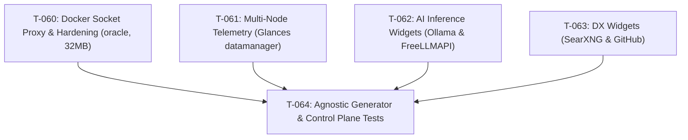

# Sprint 10 — Core

**Período**: 2026-09-27 → 2026-10-04  
**Objetivo**: «Homepage Fleet Observability, Perimetral Security & AI Telemetry». Transformar Homepage en el Centro de Comando y Observabilidad Unificada de la Flota para Agent OS. Implementar contención y aislamiento estricto del socket de Docker vía `tecnativa/docker-socket-proxy` con perfil RO y tope de 32MB de RAM en `oracle` (ADR 004), telemetría remota de hardware con Glances Web en `datamanager` sobre Tailscale, widgets nativos de inferencia local ($0) para Ollama y pasarelas OmniRoute/FreeLLMAPI, widgets DX (búsqueda SearXNG, GitHub repo status y acceso rápido ByteBox), extensión modular y determinista de `generate-homepage-config.sh` sin IPs hardcodeadas, y validación en `tests/validate-control-plane.sh`.

---

## Estado
🟡 En curso

---

## Tareas del Sprint (Fase 2D / Core)

| ID | Descripción | Categoría | Tamaño | Estado | Dependencias / Bloqueos | Task file / Goal Contract |
| :--- | :--- | :---: | :---: | :---: | :--- | :---: |
| T-060 | Seguridad Perimetral y Contención Docker Socket (`docker-socket-proxy` RO 32MB y Hardening Perimetral) | Nueva herramienta / Seguridad | M | ✅ Completada | — | [.agents/tasks/task-060.md](file:///home/romen/orca/workspaces/agent-os/homepage/.agents/tasks/task-060.md) |
| T-061 | Telemetría Multi-Nodo y Hardware (Glances en `datamanager` y Widgets Multi-Host en Cabecera) | Nueva herramienta / Infra | M | ✅ Completada | — | [.agents/tasks/task-061.md](file:///home/romen/orca/workspaces/agent-os/homepage/.agents/tasks/task-061.md) |
| T-062 | Telemetría de Inferencia IA ($0) (Widgets Nativos Ollama y Custom API OmniRoute/FreeLLMAPI) | Nueva herramienta | S | ✅ Completada | — | [.agents/tasks/task-062.md](file:///home/romen/orca/workspaces/agent-os/homepage/.agents/tasks/task-062.md) |
| T-063 | Productividad DX, Búsqueda Integrada SearXNG y Widget GitHub | DX | S | ⬜ Pendiente | — | [.agents/tasks/task-063.md](file:///home/romen/orca/workspaces/agent-os/homepage/.agents/tasks/task-063.md) |
| T-064 | Motor Declarativo Agnóstico (`generate-homepage-config.sh`), `fleet.example.yaml` y Control Plane Tests | Universalización / DX | M | ⬜ Pendiente | T-060, T-061, T-062, T-063 | [.agents/tasks/task-064.md](file:///home/romen/orca/workspaces/agent-os/homepage/.agents/tasks/task-064.md) |

---

## Requisitos de Implementación y Restricciones Arquitectónicas

1. **Cumplimiento de ADR 004 (Restricción de Recursos en `oracle`)**:
   - En `T-060`, configurar `tecnativa/docker-socket-proxy` con variables de solo lectura estrictas (`CONTAINERS=1`, `INFO=1`, `POST=0`) y limitación explícita de memoria a `32m` en compose para no penalizar el VPS `oracle`.
   - En `T-061`, Glances Web (`glances -w`) se ejecuta única y exclusivamente en el nodo `datamanager` (`100.77.82.13:61208` vía Tailscale). En `oracle`, Homepage consume métricas del host local o del socket proxy ligero sin desplegar demonios adicionales en ese nodo.
2. **Generador Declarativo Agnóstico (T-064)**:
   - El script `scripts/agent/generate-homepage-config.sh` debe parsear de forma modular las secciones opcionales de `config/fleet.yaml` (o `fleet.example.yaml`) sin asumir direcciones IP fijas ni hardcodeadas.
3. **Calidad y Verificación Determinista**:
   - Toda tarea debe superar las compuertas técnicas evaluadas por `scripts/agent/verify-goal.sh` y mantener `tests/validate-control-plane.sh` con 10/10 checks aprobados.

---

## Lotes Sugeridos de Ejecución (DAG)

- **Lote 1 (Cimientos de Infraestructura & Seguridad)**:
  - `T-060` (Proxy de contención Docker Socket RO con límite de 32MB en `templates/homepage/docker-compose.yml` + Runbook de seguridad perimetral).
  - `T-061` (Definición de Glances en `datamanager` y widgets multi-host en `widgets.yaml`).
- **Lote 2 (Widgets de Servicios & DX)**:
  - `T-062` (Widgets oficiales de Ollama en `100.77.82.13:11434` y Custom API para endpoints de inferencia gratuita).
  - `T-063` (Barra de búsqueda SearXNG, widget GitHub de `romensuarezr/agent-os` y acceso rápido a ByteBox).
- **Lote 3 (Consolidación y Verificación)**:
  - `T-064` (Generador agnóstico sin IPs hardcodeadas, actualización de `fleet.example.yaml` y validación en `tests/validate-control-plane.sh`).

---

## Contratos de Meta Declarativos (`goal.schema.md`)

### GOAL-T-060
- **goal_id**: `GOAL-T-060`
- **title**: "Seguridad Perimetral y Contención Docker Socket en Homepage"
- **assigned_profile**: `coder`
- **End State Contract**:
  - `templates/homepage/docker-compose.yml` incluye el servicio `docker-socket-proxy` (`tecnativa/docker-socket-proxy`) con variables de entorno `CONTAINERS=1`, `INFO=1`, `POST=0` y límite de memoria `mem_limit: 32m`.
  - Homepage no monta `/var/run/docker.sock` directamente; se comunica internamente con `docker-socket-proxy:2375`.
  - Existe runbook `docs/runbooks/homepage-security.md` documentando la configuración perimetral de Cloudflare Zero Trust y Traefik.
- **Allowlist**:
  - `templates/homepage/docker-compose.yml`
  - `docs/runbooks/homepage-security.md`
  - `.agents/tasks/task-060.md`
  - `docs/sprints/sprint-10-core.md`

### GOAL-T-061
- **goal_id**: `GOAL-T-061`
- **title**: "Telemetría Multi-Nodo y Hardware con Glances en DataManager"
- **assigned_profile**: `coder`
- **End State Contract**:
  - Existe plantilla compose `templates/homepage/glances-compose.yml` para desplegar Glances Web (`glances -w`) en `datamanager`.
  - `templates/homepage/config/widgets.yaml` incluye banner multi-host con Oracle VPS y DataManager Node vía Tailscale.
  - Runbook `docs/runbooks/glances-setup.md` documenta la configuración del servicio.
- **Allowlist**:
  - `templates/homepage/glances-compose.yml`
  - `templates/homepage/config/widgets.yaml`
  - `docs/runbooks/glances-setup.md`
  - `.agents/tasks/task-061.md`
  - `docs/sprints/sprint-10-core.md`

### GOAL-T-062
- **goal_id**: `GOAL-T-062`
- **title**: "Telemetría de Inferencia IA ($0) en Homepage"
- **assigned_profile**: `coder`
- **End State Contract**:
  - `templates/homepage/config/services.yaml` incluye widget nativo de Ollama (`widget: { type: "ollama" }`) reportando modelos locales instalados.
  - Se incorpora widget `customapi` para endpoints de OmniRoute y FreeLLMAPI consultando `/health` y `/models`.
- **Allowlist**:
  - `templates/homepage/config/services.yaml`
  - `.agents/tasks/task-062.md`
  - `docs/sprints/sprint-10-core.md`

### GOAL-T-063
- **goal_id**: `GOAL-T-063`
- **title**: "Productividad DX, Búsqueda SearXNG y Widget GitHub"
- **assigned_profile**: `coder`
- **End State Contract**:
  - `templates/homepage/config/settings.yaml` incluye buscador integrado de SearXNG en cabecera.
  - `templates/homepage/config/services.yaml` incorpora widget de GitHub para `romensuarezr/agent-os` y tarjeta de acceso rápido a ByteBox.
- **Allowlist**:
  - `templates/homepage/config/settings.yaml`
  - `templates/homepage/config/services.yaml`
  - `.agents/tasks/task-063.md`
  - `docs/sprints/sprint-10-core.md`

### GOAL-T-064
- **goal_id**: `GOAL-T-064`
- **title**: "Generador Declarativo Agnóstico y Hardening del Control Plane"
- **assigned_profile**: `coder`
- **End State Contract**:
  - `scripts/agent/generate-homepage-config.sh` parsea bloques opcionales `monitoring` sin direcciones IP hardcodeadas.
  - `config/fleet.example.yaml` documenta las nuevas opciones de configuración de telemetría y seguridad.
  - `tests/validate-control-plane.sh` valida la sintaxis y generación de Homepage pasando 100% de tests.
- **Allowlist**:
  - `scripts/agent/generate-homepage-config.sh`
  - `config/fleet.example.yaml`
  - `tests/validate-control-plane.sh`
  - `.agents/tasks/task-064.md`
  - `docs/sprints/sprint-10-core.md`

---

## Criterios de Éxito del Sprint 10

1. **Aislamiento Docker Conforme a ADR 004**: Homepage no tiene acceso directo a `/var/run/docker.sock`, sino a través de `tecnativa/docker-socket-proxy` en modo sólo lectura restringido y con límite de memoria a 32MB.
2. **Telemetría Multi-Host Activa**: Visibilidad combinada del VPS `oracle` y del nodo de inferencia `datamanager` sin saturar los recursos de disco y RAM de los nodos.
3. **Inferencia Local ($0) Monitorizada**: Estado en vivo de modelos Ollama (`qwen2.5:7b`, `llama3.1:8b`, etc.) y pasarelas de inferencia en el dashboard.
4. **Buscador y DX en Dashboard**: Campo de búsqueda de meta-buscador privado SearXNG integrado en la cabecera y monitorización de GitHub.
5. **Configuración 100% Declarativa y Agnóstica**: `scripts/agent/generate-homepage-config.sh` genera toda la suite de configuración de Homepage a partir de `fleet.yaml` sin hardcodear IPs ni dependencias estáticas.
6. **Verificación Determinista**: La suite `tests/validate-control-plane.sh` concluye con 0 fallos.
