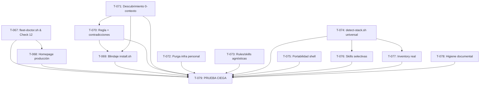

# Sprint 11 — Core Hardening, Fleet Doctor & Descubrimiento 0-contexto

**Período**: 2026-09-28 → 2026-10-09
**Objetivo**: Dejar el repo preparado para una **prueba ciega**: un agente con 0 contexto debe poder arrancar, encontrar todo lo que necesita y operar sin alucinar ni reinventar. El sprint absorbe **la totalidad de la auditoría 2026-09-28 (117 hallazgos: 32 alta · 56 media · 29 baja)** más el informe de campo del agente (batería determinista + propuesta inicial T-066–T-069). Al cerrar, el core es portable de verdad: sin infraestructura personal commiteada, con detección honesta de stack y herramientas, y con la gobernanza sin contradicciones.

**Nota de numeración**: el commit HEAD `5099bbe` ya consumió el ID T-066 (fix de homepage). Para no romper la trazabilidad, este sprint usa T-067 a T-079.

---

## Estado
✅ Aprobado por el usuario — 2026-09-28 (alcance ampliado a toda la auditoría)

---

## Tareas del Sprint

| ID | Descripción | Categoría | Tamaño | Estado | Dependencias | Task file |
| :--- | :--- | :---: | :---: | :---: | :--- | :--- |
| T-067 | `fleet-doctor.sh`: diagnóstico determinista de flota + Check 12 condicional en `validate-control-plane.sh` | Nueva herramienta / Infra | M | ✅ Completada | — | `.agents/tasks/task-067.md` |
| T-068 | Saneamiento definitivo de Homepage en producción (dominios ficticios, ping `/health`, Ollama paramétrico) | Bug del sistema / DX | S | ✅ Completada | T-067 | `.agents/tasks/task-068.md` |
| T-069 | Blindaje de `install.sh`: ruta dinámica, pre-flights, `--check`, `set -euo pipefail`, instala `AGENT_ONBOARDING.md`, `sync.sh` no destructivo | Universalización / Core | M | ✅ Completada | T-070, T-071 | `.agents/tasks/task-069.md` |
| T-070 | Regla global `deterministic-execution.md` + resolución de contradicciones entre reglas existentes | Gobernanza / Core Standard | M | ✅ Completada | T-071 | `.agents/tasks/task-070.md` |
| T-071 | Reparación del descubrimiento 0-contexto: inventario de skills, referencias fantasma, inbox canónico, `AGENT_ONBOARDING.md` como secuencia de boot | Universalización / DX | M | ✅ Completada | — | `.agents/tasks/task-071.md` |
| T-072 | Purga de infraestructura personal en scripts y config (`/home/romen`, IPs Tailscale → overlay `fleet.yaml`) | Universalización / Core | M | ✅ Completada | — | `.agents/tasks/task-072.md` |
| T-073 | Reglas y skills agnósticas de stack, flota y herramientas propietarias | Universalización / Core | M | ✅ Completada | — | `.agents/tasks/task-073.md` |
| T-074 | `detect-stack.sh` universal (Go/Rust/Java/PHP/Ruby/.NET/Bun/estático) con fallback `unknown` explícito | Bug del sistema / Core | S | ✅ Completada | — | `.agents/tasks/task-074.md` |
| T-075 | Barrido de portabilidad shell: Linux + macOS, dependencias declaradas y comprobadas | Bug del sistema / DX | M | ✅ Completada | — | `.agents/tasks/task-075.md` |
| T-076 | Instalación selectiva de skills por stack (`--minimal`/`--full`, manifiesto con etiquetas) | Universalización / DX | M | ⬜ Pendiente | T-074 | `.agents/tasks/task-076.md` |
| T-077 | `tool-inventory` y `repo-onboarding` detectan stack, CI/CD, IaC y CLIs cloud; sin promesas no implementadas | Nueva herramienta / DX | M | ⬜ Pendiente | T-074 | `.agents/tasks/task-077.md` |
| T-078 | Higiene documental: versiones, changelog, roadmap, runbooks reutilizables, convenciones de ficheros | Documentación | M | ⬜ Pendiente | — | `.agents/tasks/task-078.md` |
| T-079 | **Prueba ciega 0-contexto** — criterio de aceptación del sprint (si falla, el sprint no cierra) | Gobernanza / DX | S | ⬜ Pendiente | Todas | `.agents/tasks/task-079.md` |

---

## Requisitos de Implementación y Restricciones Arquitectónicas

1. **El core sigue siendo portable (T-067, T-068, T-072)**: `fleet-doctor.sh` lee la flota de un overlay **opcional** (`config/fleet.yaml` local, gitignored). Sin él, Check 12 hace SKIP, nunca FAIL. Ninguna IP privada, hostname de la flota del autor ni ruta `/home/romen` commiteada.
2. **Cero tokens de inferencia en diagnóstico (T-067)**: el doctor devuelve digest de 10–20 líneas; el LLM solo razona sobre el digest (principio #6 de AGENTS.md).
3. **No destructivo por defecto (T-069)**: `--check` no toca disco; pre-flights distinguen bloqueantes (git) de advertencias (infisical); `sync.sh --dry-run`.
4. **Detección honesta (T-074, T-077)**: lo que no se detecta se declara (`unknown`, `SKIPPED`, "config manual"), nunca se finge ni se degrada en silencio.
5. **Una sola fuente de verdad para el descubrimiento (T-071)**: tras el sprint, "¿dónde está X?" se responde con ≤3 archivos.
6. **Toda tarea supera `tests/validate-control-plane.sh`** (12/12 tras T-067) y `verify-goal.sh` donde aplique.

---

## Lotes Sugeridos de Ejecución (DAG)

- **Lote 1 (Cimientos: diagnóstico, descubrimiento, detección, portabilidad)**: T-067, T-071, T-074, T-075. Independientes entre sí.
- **Lote 2 (Desacople y remediación)**: T-072, T-073, T-078 (independientes) + T-068 (tras T-067) + T-070 (tras T-071) + T-076, T-077 (tras T-074).
- **Lote 3 (Bootstrapping blindado)**: T-069 (tras T-070 y T-071).
- **Lote 4 (Verificación)**: T-079. Puerta de cierre.

---

## Mapa de cobertura — auditoría 2026-09-28 → tareas

| Hallazgos | Tarea |
| :--- | :--- |
| Scripts A1 (`install.sh` path), A11 (pipefail), A12 (sync destructivo), M7 (sync no propaga templates) | T-069 |
| Scripts A1–A4 resto (`/home/romen` en contribute/check-session/coolify/audit-orca/orca-orchestrate), IPs en `routing-policy.yaml`/`agent-registry.yaml`, `fleet.example.yaml` | T-072 |
| Scripts A5 + M12 (`detect-stack.sh` solo python/JS, layout asumido) | T-074 |
| Scripts A6–A10 (flags GNU/macOS, `/Users`), M1–M4 (shebangs, deps sin comprobar) | T-075 |
| Rules: agnosticidad (`agent-permissions`, `dry-architecture`, ejemplos Node/Firestore), `preferred_model_tier` inválido, registry incompleto, `known-web-tools.yaml` sin uso | T-073 |
| Rules: C1–C3 contradicciones, `tool-decision-flow` paso 1, triggers en 15 reglas | T-070 |
| Skills: `skills-inventory.md` 1/24, 6 skills fantasma, `external-inbox/` 3 rutas, `AGENT_ONBOARDING.md` no instalado, árbol AGENTS.md vs código, refs fantasma (`core-planning.md`, `investigar-repos-referencia`…) | T-071 |
| Skills: copia 100% sin filtro | T-076 |
| Skills: `tool-inventory` ciego (CI/IaC/cloud), promesa Firefox, `repo-onboarding` sin stack | T-077 |
| Skills: `architecture-audit` débil, skills Antigravity propietarias | T-073 |
| Docs: README 1.1 vs changelog 1.9.0, changelog desactualizado, roadmap, DoD huérfano, casing, `critical-flows.md`, runbooks-diario | T-078 |
| Campo: batería determinista, 401 FreeLLMAPI, Ollama caído, dominios ficticios | T-067, T-068 |
| Campo: propuesta T-066–T-069 + regla de gobernanza | T-067 – T-070 (renumeradas) |

---

## Criterios de cierre del sprint

- [ ] Las 13 tareas en Done con sus criterios verificados.
- [ ] `tests/validate-control-plane.sh` 12/12 (o 11/12 + 1 SKIP documentado sin `fleet.yaml`).
- [ ] `grep -rn "/home/romen" scripts/` → 0; `grep -rEn "100\.[0-9]+\.[0-9]+\.[0-9]+" config/` → 0 (salvo ejemplo documentado).
- [ ] **T-079 en verde**: la prueba ciega pasa limpia — 0 alucinaciones, 0 improvisaciones, protocolo registrado en `docs/runbooks/prueba-ciega.md`.
- [ ] `roadmap.md` y `changelog.md` actualizados; tasks archivadas al cerrar.
